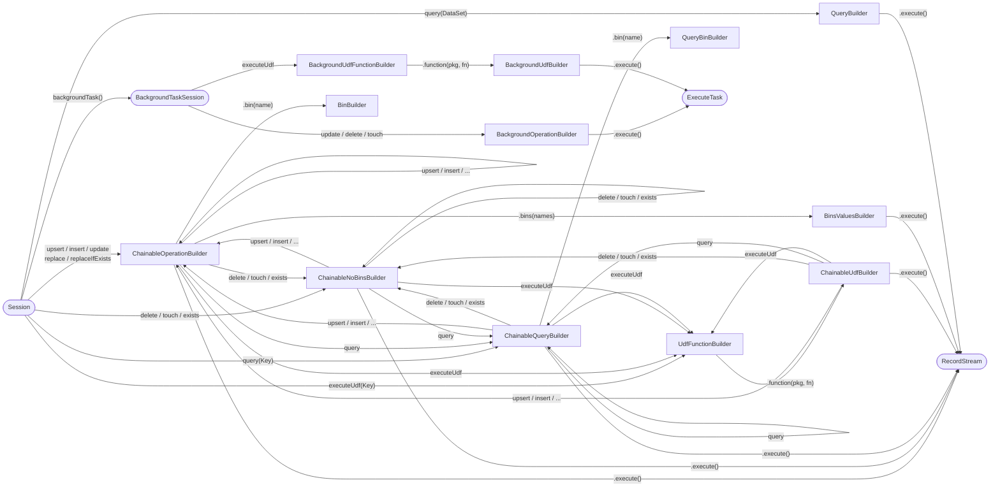
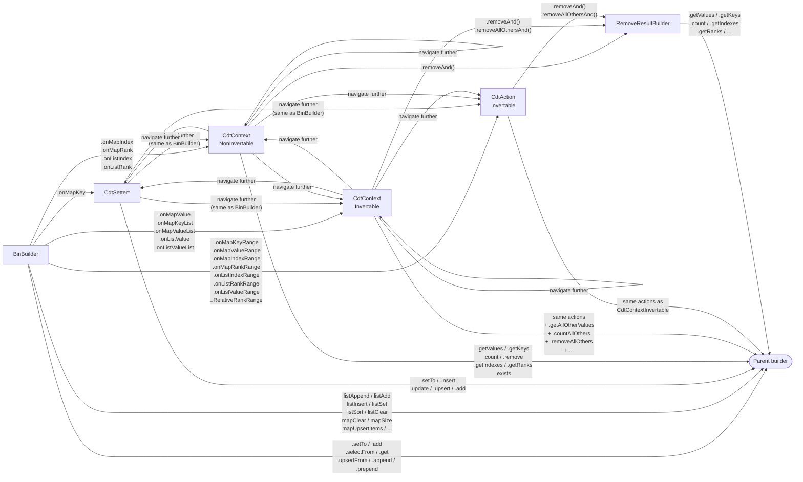

# API Builder Reference

This document shows the valid method calls at each level of the SDK's fluent API
and how the builders chain together.

## API Flow

The following diagram shows how builders connect. Each box is a builder type; each
arrow is a method call that transitions to the next builder.



## CDT Operation Flow

When you call `.bin(name)` on a write or query builder, you enter the CDT
navigation chain. The return type of each navigation method determines what you
can do next.



**Key:** `CdtSetter*`, `CdtContext*`, and `CdtAction*` each come in two flavours —
`NonInvertable` (single-element selectors like `onMapKey`, `onMapIndex`) and
`Invertable` (multi-element selectors like `onMapKeyRange`, `onListValue`).
The invertable variants add `getAllOther*` and `removeAllOthers*` methods.

---

## Properties by Builder Type

### ChainableOperationBuilder

```
session.upsert(key)
    ├── .bin(name)                        → BinBuilder
    ├── .bins(name, ...)                  → BinsValuesBuilder
    │
    ├── .expireRecordAfter(Duration)      // Per-record expiration
    ├── .expireRecordAfterSeconds(int)
    ├── .expireRecordAt(Date)
    ├── .expireRecordAt(LocalDateTime)
    ├── .withNoChangeInExpiration()
    ├── .neverExpire()
    ├── .expiryFromServerDefault()
    │
    ├── .defaultExpireRecordAfter(Duration)     // Default expiration for batch
    ├── .defaultExpireRecordAfterSeconds(long)
    ├── .defaultExpireRecordAt(LocalDateTime)
    ├── .defaultExpireRecordAt(Date)
    ├── .defaultNeverExpire()
    ├── .defaultNoChangeInExpiration()
    ├── .defaultExpiryFromServerDefault()
    │
    ├── .ensureGenerationIs(int)
    │
    ├── .where(String, Object...)         // Per-operation filter
    ├── .where(BooleanExpression)
    ├── .where(PreparedAel, Object...)
    ├── .where(Exp)
    ├── .where(Expression)
    │
    ├── .defaultWhere(String, Object...)  // Default filter for batch
    ├── .defaultWhere(BooleanExpression)
    ├── .defaultWhere(PreparedAel, Object...)
    ├── .defaultWhere(Exp)
    │
    ├── .failOnFilteredOut()
    ├── .includeMissingKeys()
    │
    ├── .notInAnyTransaction()
    ├── .inTransaction(Txn)
    ├── .sendKey()
    │
    ├── .upsert(key) / .insert / .update / .replace / .replaceIfExists
    ├── .delete(key) / .touch / .exists   → ChainableNoBinsBuilder
    ├── .query(key)                       → ChainableQueryBuilder
    ├── .executeUdf(key)                  → UdfFunctionBuilder
    │
    ├── .execute()                        → RecordStream
    ├── .execute(ErrorStrategy)           → RecordStream
    ├── .execute(ErrorHandler)            → RecordStream
    ├── .executeAsync(ErrorStrategy)      → RecordStream
    └── .executeAsync(ErrorHandler)       → RecordStream
```

### ChainableNoBinsBuilder

```
session.delete(key)
    ├── .expireRecordAfter(Duration)      // Per-record expiration (for touch)
    ├── .expireRecordAfterSeconds(int)
    ├── .expireRecordAt(Date)
    ├── .expireRecordAt(LocalDateTime)
    ├── .withNoChangeInExpiration()
    ├── .neverExpire()
    ├── .expiryFromServerDefault()
    │
    ├── .defaultExpireRecordAfter(Duration)
    ├── .defaultExpireRecordAfterSeconds(long)
    ├── .defaultExpireRecordAt(LocalDateTime)
    ├── .defaultExpireRecordAt(Date)
    ├── .defaultNeverExpire()
    ├── .defaultNoChangeInExpiration()
    ├── .defaultExpiryFromServerDefault()
    │
    ├── .ensureGenerationIs(int)
    │
    ├── .where(String, Object...)
    ├── .where(BooleanExpression)
    ├── .where(PreparedAel, Object...)
    ├── .where(Exp)
    ├── .where(Expression)
    │
    ├── .defaultWhere(String, Object...)
    ├── .defaultWhere(BooleanExpression)
    ├── .defaultWhere(PreparedAel, Object...)
    ├── .defaultWhere(Exp)
    │
    ├── .failOnFilteredOut()
    ├── .includeMissingKeys()
    │
    ├── .notInAnyTransaction()
    ├── .inTransaction(Txn)
    ├── .durablyDelete(boolean)
    │
    ├── .upsert(key) / .insert / ...      → ChainableOperationBuilder
    ├── .delete(key) / .touch / .exists
    ├── .query(key)                       → ChainableQueryBuilder
    ├── .executeUdf(key)                  → UdfFunctionBuilder
    │
    ├── .execute()                        → RecordStream
    ├── .execute(ErrorStrategy)           → RecordStream
    ├── .execute(ErrorHandler)            → RecordStream
    ├── .executeAsync(ErrorStrategy)      → RecordStream
    └── .executeAsync(ErrorHandler)       → RecordStream
```

### ChainableQueryBuilder

```
session.query(key)
    ├── .bins(name, ...)
    ├── .readingOnlyBins(name, ...)
    ├── .withNoBins()
    ├── .bin(name)                        → QueryBinBuilder
    │       ├── .get()
    │       └── .selectFrom(expr)
    │
    ├── .where(String, Object...)
    ├── .where(BooleanExpression)
    ├── .where(PreparedAel, Object...)
    ├── .where(Exp)
    ├── .where(Expression)
    │
    ├── .defaultWhere(String, Object...)
    ├── .defaultWhere(BooleanExpression)
    ├── .defaultWhere(PreparedAel, Object...)
    ├── .defaultWhere(Exp)
    │
    ├── .defaultExpireRecordAfter(Duration)
    ├── .defaultExpireRecordAfterSeconds(long)
    ├── .defaultExpireRecordAt(LocalDateTime)
    ├── .defaultExpireRecordAt(Date)
    ├── .defaultNeverExpire()
    ├── .defaultNoChangeInExpiration()
    ├── .defaultExpiryFromServerDefault()
    │
    ├── .failOnFilteredOut()
    ├── .includeMissingKeys()
    │
    ├── .notInAnyTransaction()
    ├── .inTransaction(Txn)
    │
    ├── .limit(long)
    ├── .onPartition(int)
    ├── .onPartitionRange(int, int)
    ├── .chunkSize(int)
    │
    ├── .upsert(key) / .insert / ...      → ChainableOperationBuilder
    ├── .delete(key) / .touch / .exists   → ChainableNoBinsBuilder
    ├── .query(key)
    ├── .executeUdf(key)                  → UdfFunctionBuilder
    │
    ├── .execute()                        → RecordStream
    ├── .execute(ErrorStrategy)           → RecordStream
    ├── .execute(ErrorHandler)            → RecordStream
    ├── .executeAsync(ErrorStrategy)      → RecordStream
    └── .executeAsync(ErrorHandler)       → RecordStream
```

### ChainableUdfBuilder

```
session.executeUdf(key).function("pkg", "fn")
    ├── .passing(Object...)
    ├── .passingValues(Value...)
    ├── .passing(List<?>)
    ├── .passingValues(List<Value>)
    │
    ├── .expireRecordAfter(Duration)
    ├── .expireRecordAfterSeconds(int)
    ├── .expireRecordAt(Date)
    ├── .expireRecordAt(LocalDateTime)
    ├── .withNoChangeInExpiration()
    ├── .neverExpire()
    ├── .expiryFromServerDefault()
    │
    ├── .defaultExpireRecordAfter(Duration)
    ├── .defaultExpireRecordAfterSeconds(long)
    ├── .defaultExpireRecordAt(LocalDateTime)
    ├── .defaultExpireRecordAt(Date)
    ├── .defaultNeverExpire()
    ├── .defaultNoChangeInExpiration()
    ├── .defaultExpiryFromServerDefault()
    │
    ├── .ensureGenerationIs(int)
    │
    ├── .where(String, Object...)
    ├── .where(BooleanExpression)
    ├── .where(PreparedAel, Object...)
    ├── .where(Exp)
    ├── .where(Expression)
    │
    ├── .defaultWhere(String, Object...)
    ├── .defaultWhere(BooleanExpression)
    ├── .defaultWhere(PreparedAel, Object...)
    ├── .defaultWhere(Exp)
    │
    ├── .failOnFilteredOut()
    ├── .includeMissingKeys()
    │
    ├── .upsert(key) / .insert / ...      → ChainableOperationBuilder
    ├── .delete(key) / .touch / .exists   → ChainableNoBinsBuilder
    ├── .query(key)                       → ChainableQueryBuilder
    ├── .executeUdf(key)                  → UdfFunctionBuilder
    │
    ├── .execute()                        → RecordStream
    ├── .execute(ErrorStrategy)           → RecordStream
    ├── .execute(ErrorHandler)            → RecordStream
    ├── .executeAsync(ErrorStrategy)      → RecordStream
    └── .executeAsync(ErrorHandler)       → RecordStream
```

### BinsValuesBuilder

```
session.upsert(key).bins("a", "b").values(1, 2)
    ├── .values(...)                      // Values for next key
    │
    ├── .ensureGenerationIs(int)
    ├── .expireRecordAfter(Duration)
    ├── .expireRecordAfterSeconds(int)
    ├── .expireRecordAt(Date)
    ├── .expireRecordAt(LocalDateTime)
    ├── .withNoChangeInExpiration()
    ├── .neverExpire()
    ├── .expiryFromServerDefault()
    │
    ├── .defaultExpireRecordAfter(Duration)
    ├── .defaultExpireRecordAfterSeconds(long)
    ├── .defaultExpireRecordAt(LocalDateTime)
    ├── .defaultExpireRecordAt(Date)
    ├── .defaultNeverExpire()
    ├── .defaultNoChangeInExpiration()
    ├── .defaultExpiryFromServerDefault()
    │
    ├── .where(String, Object...)
    ├── .where(BooleanExpression)
    ├── .where(PreparedAel, Object...)
    ├── .where(Exp)
    ├── .where(Expression)
    │
    ├── .failOnFilteredOut()
    ├── .includeMissingKeys()
    │
    ├── .notInAnyTransaction()
    ├── .inTransaction(Txn)
    │
    ├── .execute()                        → RecordStream
    ├── .execute(ErrorStrategy)           → RecordStream
    ├── .execute(ErrorHandler)            → RecordStream
    ├── .executeAsync(ErrorStrategy)      → RecordStream
    └── .executeAsync(ErrorHandler)       → RecordStream
```

### QueryBuilder (dataset queries)

```
session.query(dataSet)
    ├── .readingOnlyBins(name, ...)
    ├── .withNoBins()
    ├── .bin(name)                        → QueryBuilderBinBuilder
    │       └── .selectFrom(expr)
    │
    ├── .where(String, Object...)
    ├── .where(BooleanExpression)
    ├── .where(Expression)
    ├── .where(Exp)
    ├── .where(PreparedAel, Object...)
    │
    ├── .failOnFilteredOut()
    ├── .includeMissingKeys()
    │
    ├── .recordsPerSecond(int)
    ├── .withHint(hint -> ...)
    │
    ├── .limit(long)
    ├── .chunkSize(int)
    ├── .onPartition(int)
    ├── .onPartitionRange(int, int)
    │
    ├── .notInAnyTransaction()
    ├── .inTransaction(Txn)
    │
    ├── .execute()                        → RecordStream
    ├── .execute(ErrorStrategy)           → RecordStream
    ├── .execute(ErrorHandler)            → RecordStream
    ├── .executeAsync(ErrorStrategy)      → RecordStream
    └── .executeAsync(ErrorHandler)       → RecordStream
```

### OperationObjectBuilder / ObjectBuilder

```
session.upsert(dataSet)
    ├── .object(obj)                      → ObjectBuilder
    ├── .objects(List<T>)                 → ObjectBuilder
    ├── .objects(T, T, T...)              → ObjectBuilder
    ├── .bins(name, ...)                  → IdValuesBuilder
    │
    ├── .where(String, Object...)
    ├── .where(BooleanExpression)
    ├── .where(PreparedAel, Object...)
    ├── .where(Exp)
    ├── .where(Expression)
    │
    ├── .failOnFilteredOut()
    └── .includeMissingKeys()

ObjectBuilder (after .object()):
    ├── .object(obj2)                     // Add more objects
    ├── .objects(List<T>)
    ├── .using(RecordMapper<T>)           // Override mapper
    │
    ├── .ensureGenerationIs(int)
    ├── .expireRecordAfter(Duration)
    ├── .expireRecordAfterSeconds(int)
    ├── .expireRecordAt(Date)
    ├── .expireRecordAt(LocalDateTime)
    ├── .withNoChangeInExpiration()
    ├── .neverExpire()
    ├── .expiryFromServerDefault()
    │
    ├── .defaultExpireRecordAfter(Duration)
    ├── .defaultExpireRecordAfterSeconds(long)
    ├── .defaultExpireRecordAt(LocalDateTime)
    ├── .defaultExpireRecordAt(Date)
    ├── .defaultNeverExpire()
    ├── .defaultNoChangeInExpiration()
    │
    ├── .notInAnyTransaction()
    ├── .inTransaction(Txn)
    │
    └── .execute()                        → RecordStream
```

### BackgroundOperationBuilder

```
session.backgroundTask().update(dataSet)
    ├── .bin(name)                        → BinBuilder
    │
    ├── .where(String, Object...)
    ├── .where(BooleanExpression)
    ├── .where(PreparedAel, Object...)
    ├── .where(Exp)
    ├── .where(Expression)
    │
    ├── .recordsPerSecond(int)
    │
    └── .execute()                        → ExecuteTask
```

### BackgroundUdfBuilder

```
session.backgroundTask().executeUdf(dataSet).function("pkg", "fn")
    ├── .passing(Object...)
    ├── .passingValues(Value...)
    ├── .passing(List<?>)
    │
    ├── .where(String, Object...)
    ├── .where(BooleanExpression)
    ├── .where(PreparedAel, Object...)
    ├── .where(Exp)
    ├── .where(Expression)
    │
    ├── .recordsPerSecond(int)
    │
    └── .execute()                        → ExecuteTask
```

---

## CDT Navigation Detail

The CDT (Collection Data Type) chain is entered from `BinBuilder` and allows
navigating into nested list and map structures before choosing an action.

### Navigation methods and what they return

| Method | Returns | When to use |
|--------|---------|-------------|
| `onMapKey(key)` | `CdtSetterNonInvertable` | Single map key — can set, navigate, or get/remove |
| `onMapIndex(idx)` | `CdtContextNonInvertable` | Single map index — can navigate or get/remove |
| `onMapRank(rank)` | `CdtContextNonInvertable` | Single map rank — can navigate or get/remove |
| `onMapValue(val)` | `CdtContextInvertable` | Map entries by value — may match multiple |
| `onMapKeyList(list)` | `CdtContextInvertable` | Map entries by key list — multiple keys |
| `onMapValueList(list)` | `CdtContextInvertable` | Map entries by value list — multiple values |
| `onMapKeyRange(start, end)` | `CdtActionInvertable` | Map key range — terminal selection |
| `onMapValueRange(start, end)` | `CdtActionInvertable` | Map value range — terminal selection |
| `onMapIndexRange(idx [, count])` | `CdtActionInvertable` | Map index range — terminal selection |
| `onMapRankRange(rank [, count])` | `CdtActionInvertable` | Map rank range — terminal selection |
| `onMapKeyRelativeIndexRange(...)` | `CdtActionInvertable` | Relative index from key |
| `onMapValueRelativeRankRange(...)` | `CdtActionInvertable` | Relative rank from value |
| `onListIndex(idx)` | `CdtContextNonInvertable` | Single list index — can navigate or get/remove |
| `onListRank(rank)` | `CdtContextNonInvertable` | Single list rank — can navigate or get/remove |
| `onListValue(val)` | `CdtContextInvertable` | List elements by value — may match multiple |
| `onListValueList(list)` | `CdtContextInvertable` | List elements by value list — multiple values |
| `onListIndexRange(idx [, count])` | `CdtActionInvertable` | List index range — terminal selection |
| `onListRankRange(rank [, count])` | `CdtActionInvertable` | List rank range — terminal selection |
| `onListValueRange(start, end)` | `CdtActionInvertable` | List value range — terminal selection |
| `onListValueRelativeRankRange(...)` | `CdtActionInvertable` | Relative rank from value |

### Actions available at each level

| Action | NonInvertable | Invertable | Description |
|--------|:---:|:---:|-------------|
| `getValues()` | yes | yes | Return selected values |
| `getKeys()` | yes | yes | Return selected keys (maps only) |
| `count()` | yes | yes | Return count of selected elements |
| `getIndexes()` | yes | yes | Return indexes of selected elements |
| `getReverseIndexes()` | yes | yes | Return reverse indexes |
| `getRanks()` | yes | yes | Return ranks |
| `getReverseRanks()` | yes | yes | Return reverse ranks |
| `getKeysAndValues()` | yes | yes | Return key-value pairs (maps only) |
| `exists()` | yes | yes | Return true if any match |
| `remove()` | yes | yes | Remove selected, return nothing |
| `removeAnd().getValues()` | yes | yes | Remove selected, return values |
| `getAllOtherValues()` | — | yes | Return values NOT matching selection |
| `getAllOtherKeys()` | — | yes | Return keys NOT matching selection |
| `countAllOthers()` | — | yes | Count elements NOT matching selection |
| `getAllOtherIndexes()` | — | yes | Indexes NOT matching selection |
| `getAllOtherReverseIndexes()` | — | yes | Reverse indexes NOT matching |
| `getAllOtherRanks()` | — | yes | Ranks NOT matching selection |
| `getAllOtherReverseRanks()` | — | yes | Reverse ranks NOT matching |
| `getAllOtherKeysAndValues()` | — | yes | Key-value pairs NOT matching |
| `removeAllOthers()` | — | yes | Remove NOT matching, return nothing |
| `removeAllOthersAnd().getValues()` | — | yes | Remove NOT matching, return values |

### CdtSetter actions (from `onMapKey`)

In addition to all the navigation and action methods above, `CdtSetter*` adds:

| Method | Description |
|--------|-------------|
| `setTo(value)` | Set the value unconditionally |
| `insert(value)` | Set only if key doesn't exist |
| `update(value)` | Set only if key already exists |
| `upsert(value)` | Create or update unconditionally |
| `add(value)` | Atomically increment numeric value |

Each accepts `long`, `String`, `byte[]`, `boolean`, `double`, `List<?>`, `Map<?,?>`,
and `RecordMapper<U>` overloads. `insert`, `update`, and `upsert` also have overloads
accepting `Consumer<MapEntryWriteOptions>` to control create-only / update-only
semantics and map ordering.
