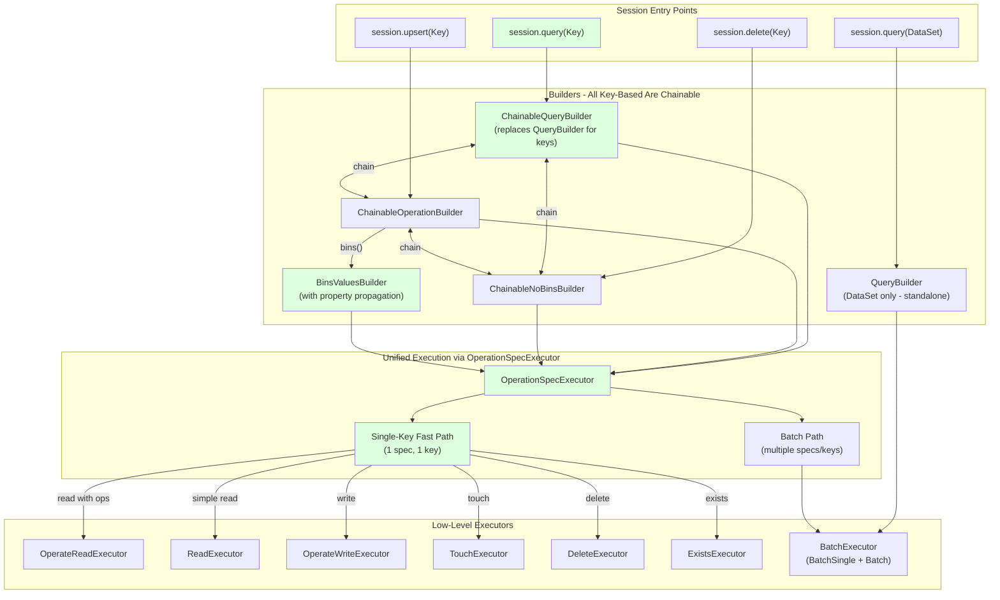

# Fluent API Architecture Evolution

This document describes the current architecture of the Aerospike Fluent Java Client and the improvements implemented to fix API asymmetry, optimize single-key operations, and ensure property propagation.

**Last Updated:** All phases complete, plus additional fixes for property propagation and code consolidation

## Implementation Summary

The following changes have been successfully implemented:

### Phase 1: Single-Key Optimization in OperationSpecExecutor
- Added detection for single-spec, single-key scenarios at the start of `execute()`
- Implemented `executeSingleKey()` which routes to the appropriate point executor:
  - `executeSingleKeyRead()` - uses `ReadExecutor` or `OperateReadExecutor`
  - `executeSingleKeyWrite()` - uses `OperateWriteExecutor`
  - `executeSingleKeyExists()` - uses `ExistsExecutor`
  - `executeSingleKeyTouch()` - uses `TouchExecutor`
  - `executeSingleKeyDelete()` - uses `DeleteExecutor`
- This bypasses all batch infrastructure for single-key operations, reducing overhead significantly

### Phase 2: Query Chaining Symmetry
- Changed `Session.query(Key)`, `Session.query(Key, Key, Key...)`, and `Session.query(List<Key>)` to return `ChainableQueryBuilder`
- Now both paths support identical chaining:
  - `session.query(key).upsert(key2)` - works!
  - `session.upsert(key).query(key2)` - works!
- Added compatibility methods to `ChainableQueryBuilder`:
  - `readingOnlyBins()` - alias for `bins()`
  - `withNoBins()` - header-only queries
  - `executeSync()` and `executeAsync()` - execution variants
  - `limit(long)` - limits the number of keys/results
  - `onPartition(int)` - filters keys to a specific partition
  - `onPartitionRange(int, int)` - filters keys to a partition range
  - `chunkSize(int)` - accepted for API compatibility (no-op for key-based queries)

### Phase 3: Cleanup
- Removed debug `System.out.println` statement from `ChainableNoBinsBuilder.isSingleKeyOperation()`

### Additional Fixes: BinsValuesBuilder Property Propagation
Fixed properties not propagating when transitioning from `ChainableOperationBuilder` to `BinsValuesBuilder` via `.bins()`:
- Added `generationForAll` field to `BinsValuesBuilder`
- Added `initFromParent()` method to receive properties from parent builder
- Now all properties set before `.bins()` are correctly propagated:
  - `expirationInSeconds` - passed via constructor
  - `generation` - passed via `initFromParent()` to `generationForAll`
  - `whereClause` - passed via `initFromParent()` to `dsl` field
  - `failOnFilteredOut` - passed via `initFromParent()` to inherited field
  - `respondAllKeys` - passed via `initFromParent()` to inherited field

### Code Consolidation: AbstractOperationBuilder
Moved shared constants and methods from `OperationBuilder` to `AbstractOperationBuilder`:
- `TTL_NEVER_EXPIRE = -1`
- `TTL_NO_CHANGE = -2`
- `TTL_SERVER_DEFAULT = 0`
- `BATCH_OPERATION_THRESHOLD = 10`
- `getBatchOperationThreshold()` method
- `areOperationsRetryable(List<Operation>)` method

This allows all builders extending `AbstractOperationBuilder` to access these shared utilities.

---

## Architecture Details

### Current Architecture Overview

1. **Single-Key Optimizations:**
   - `OperationSpecExecutor` now detects single-spec, single-key scenarios and routes directly to point executors
   - Bypasses all batch infrastructure (BatchRecord, BatchNodes, BatchExecutor) for maximum performance
   - Works for all operation types: read, write, delete, touch, exists

2. **Unified Chaining:**
   - All key-based operations chain freely in any direction
   - `session.query(Key)` returns `ChainableQueryBuilder` (not standalone `QueryBuilder`)
   - `session.query(DataSet)` returns `QueryBuilder` (appropriate for scans - no chaining)

3. **Property Propagation:**
   - Properties set on builders are correctly propagated during transitions
   - `ChainableOperationBuilder` → `BinsValuesBuilder` via `.bins()` now passes all properties
   - Uses `initFromParent()` for generation, whereClause, failOnFilteredOut, respondAllKeys

4. **Shared Utilities:**
   - TTL constants and batch threshold moved to `AbstractOperationBuilder`
   - All builders inherit common functionality through the class hierarchy

### User-Facing API (Text Diagram) - CURRENT STATE

```
Session
├── query(Key...)
│   └── ChainableQueryBuilder (CAN CHAIN to writes!)
│       ├── upsert/update/insert/delete/touch() → chain to other builders
│       └── execute() → OperationSpecExecutor
│           ├── single-key → Direct executors (OPTIMIZED)
│           └── batch → BatchExecutor
│
├── query(DataSet)
│   └── QueryBuilder (standalone - appropriate for scans)
│       └── execute() → IndexQueryBuilderImpl (scan/index query)
│
├── upsert/update/insert/replace/replaceIfExists(Key...)
│   └── ChainableOperationBuilder
│       ├── query() → ChainableQueryBuilder
│       ├── bins() → BinsValuesBuilder (with property propagation)
│       └── execute() → OperationSpecExecutor
│           ├── single-key → Direct OperateWriteExecutor (OPTIMIZED)
│           └── batch → BatchExecutor
│
├── touch/exists/delete(Key...)
│   └── ChainableNoBinsBuilder
│       ├── query() → ChainableQueryBuilder
│       └── execute() → OperationSpecExecutor
│           ├── single-key → Direct executors (OPTIMIZED)
│           └── batch → BatchExecutor
│
└── upsert/update/insert(DataSet)
    └── OperationObjectBuilder → ObjectBuilder
        └── execute() → single-key: OperateWriteExecutor (OPTIMIZED)
                      → batch: BatchExecutor
```

### Current Flow Diagram (Mermaid) - IMPLEMENTED STATE



**Legend:**
- Green: Implemented and working correctly

### Previous Problems (NOW FIXED)

1. **API Asymmetry**: ~~`session.query(key).upsert(...)` does NOT compile~~ → ✅ Now works via `ChainableQueryBuilder`
2. **Batch Infrastructure Overhead**: ~~Single-key operations via `ChainableOperationBuilder` have overhead~~ → ✅ Fixed via `OperationSpecExecutor` single-key optimization
3. **Inconsistency**: ~~`ChainableNoBinsBuilder` has optimization but `ChainableOperationBuilder` does not~~ → ✅ Both now use `OperationSpecExecutor` with single-key fast path
4. **Property Loss with bins()**: ~~Properties set before `.bins()` were lost~~ → ✅ Fixed via `BinsValuesBuilder.initFromParent()`

---

## Changes Summary (IMPLEMENTED)

| Aspect | Before | After |
|--------|--------|-------|
| `session.query(Key)` returns | `QueryBuilder` (no chaining) | `ChainableQueryBuilder` (can chain) ✅ |
| `session.query(DataSet)` returns | `QueryBuilder` | `QueryBuilder` (unchanged) |
| `session.query(key).upsert(...)` | Does NOT compile | Compiles and works ✅ |
| Single-key via `ChainableOperationBuilder` | BatchNodes + BatchSingle (overhead) | Direct executor (no overhead) ✅ |
| `ChainableNoBinsBuilder` single-key | OperationWithNoBinsBuilder | OperationSpecExecutor fast path ✅ |
| Execution consistency | Multiple paths | All through OperationSpecExecutor ✅ |
| Property propagation to `BinsValuesBuilder` | Lost on `.bins()` | All properties propagated via `initFromParent()` ✅ |
| TTL constants location | `OperationBuilder` | `AbstractOperationBuilder` (shared) ✅ |

---

## API Examples (All Working)

### Query First, Then Write ✅

```java
session.query(key1)
       .bin("name").get()
       .upsert(key2).bin("status").setTo("active")
       .execute();
```

### Write First, Then Query ✅

```java
session.upsert(key1).bin("x").setTo(1)
       .query(key2)
       .execute();
```

### Single-Key Write (Optimized) ✅

```java
// Direct OperateWriteExecutor call - no batch infrastructure overhead
session.upsert(key).bin("x").setTo(1).execute();
```

### Dataset Query (standalone) ✅

```java
session.query(myDataSet).where("$.age > 21").execute();
```

### Full Chaining Example ✅

```java
session
    .query(key1)                              // Read key1
        .bin("profile").get()
    .upsert(key2)                             // Write to key2
        .bin("status").setTo("processed")
    .delete(key3)                             // Delete key3
    .query(key4)                              // Read key4
        .bin("summary").selectFrom("$.a + $.b")
    .execute();
```

### Bins/Values with Properties (Fixed) ✅

```java
// All properties now propagate correctly to BinsValuesBuilder
session.upsert(key)
    .expireRecordAfterSeconds(5)  // ✅ Propagated
    .ensureGenerationIs(3)        // ✅ Propagated
    .where("$.age > 21")          // ✅ Propagated
    .failOnFilteredOut()          // ✅ Propagated
    .respondAllKeys()             // ✅ Propagated
    .bins("a", "b")               // Properties passed via initFromParent()
    .values(1, 2)
    .execute();
```

---

## Implementation Phases (ALL COMPLETE)

### Phase 1: Single-Key Optimization in OperationSpecExecutor ✅

**Goal:** Bypass batch infrastructure for single-spec, single-key operations

**Implemented:**
- Detection at start of `OperationSpecExecutor.execute()` for single-spec, single-key scenarios
- `executeSingleKeyWrite()` using `OperateWriteExecutor`
- `executeSingleKeyRead()` using `ReadExecutor` or `OperateReadExecutor`
- `executeSingleKeyDelete/Touch/Exists()` using respective executors
- `OpShape.POINT` settings for proper policy configuration

**Benefits Achieved:**
- No `BatchRecord` object creation for single-key ops
- No `BatchNodes.generate()` call
- No `BatchExecutor.execute()` orchestration
- Direct path to low-level executor

### Phase 2: Query Chaining Fix ✅

**Goal:** Allow `session.query(key).upsert(...)` to compile

**Implemented:**
- `Session.query(Key key)` returns `ChainableQueryBuilder`
- `Session.query(Key key1, Key key2, Key... keys)` returns `ChainableQueryBuilder`
- `Session.query(List<Key> keys)` returns `ChainableQueryBuilder`
- `Session.query(DataSet)` returns `QueryBuilder` (unchanged)
- Added compatibility methods: `readingOnlyBins()`, `withNoBins()`, `limit()`, `onPartition()`, `onPartitionRange()`, `chunkSize()`

### Phase 3: Cleanup ✅

**Implemented:**
- Removed debug `System.out.println` in `ChainableNoBinsBuilder.isSingleKeyOperation()`

### Phase 4: Property Propagation Fix ✅

**Goal:** Ensure properties set before `.bins()` are not lost

**Implemented:**
- Added `generationForAll` field to `BinsValuesBuilder`
- Added `initFromParent()` method to receive properties from parent builder
- Modified `ChainableOperationBuilder.bins()` to call `initFromParent()`
- All properties now propagate: expiration, generation, whereClause, failOnFilteredOut, respondAllKeys

### Phase 5: Code Consolidation ✅

**Goal:** Move shared constants/methods to common location

**Implemented:**
- Moved to `AbstractOperationBuilder`:
  - `TTL_NEVER_EXPIRE`, `TTL_NO_CHANGE`, `TTL_SERVER_DEFAULT`
  - `BATCH_OPERATION_THRESHOLD`
  - `getBatchOperationThreshold()`
  - `areOperationsRetryable(List<Operation>)`
- Updated all references in `OperationWithNoBinsBuilder`, `ObjectBuilder`, `BinsValuesBuilder`, `BackgroundOperationBuilder`

---

## Benefits Achieved

1. **Symmetric API**: All key-based operations can chain freely in any direction ✅
2. **True Single-Key Performance**: Bypass ALL batch infrastructure for single-key operations ✅
3. **Consistency**: Single execution path through `OperationSpecExecutor` for all chainable operations ✅
4. **Maintainability**: Centralized optimization logic, less code duplication ✅
5. **Clearer Architecture**: Dataset queries are clearly separate from key-based operations ✅
6. **Property Integrity**: Properties set on builders propagate correctly through transitions ✅
7. **Code Organization**: Shared constants/methods consolidated in `AbstractOperationBuilder` ✅

## Related Documentation

- [API Properties Analysis](api-properties-analysis.md) - Detailed analysis of property propagation across builders
