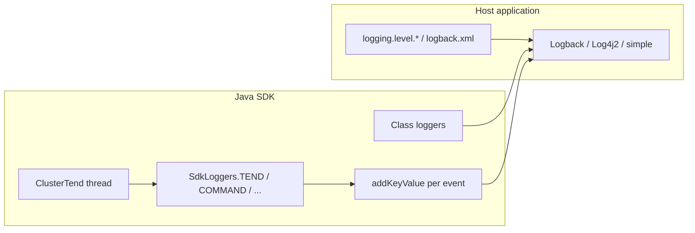

# [PRD] - Java SDK logging (SLF4J)

## Status

### Document Status

| | |
|---|---|
| **Doc stage** | DRAFT |
| **Stage options** | DRAFT → IN REVIEW → READY FOR IMPLEMENTATION → POST IMPLEMENTATION REVIEW → SHIPPED |

### Approvals

| Role | Approver | Date | Comments |
|------|----------|------|----------|
| PM Approval | | | |
| Eng Approval 1 | | | |
| Eng Approval 2 | | | |
| Stakeholder approval | | | |

### Relevant Links

| Item | Link |
|------|------|
| ProductCentral Initiative | |
| ProductCentral Feature | |
| PRFAQ | |
| Design (engineering spec) | [logging-java.md](logging-java.md) |
| Related observability | [observability.md](observability.md) (metrics, traces — out of scope for this PRD) |

---

## Meta

### Tickets

| Track | Ticket(s) |
|-------|-----------|
| REL Ticket | |
| PROD Ticket | |
| SERVER Ticket(s) | N/A |
| CLIENTS Ticket(s) | TBD |
| TOOLS Ticket(s) | N/A |
| QE Ticket(s) | TBD |
| DOCS Ticket(s) | TBD |
| PAR Ticket(s) | N/A |
| CONNECTORS Ticket(s) | N/A (connectors embed the client; host logging config applies) |
| O&M Ticket(s) | N/A |
| FRAMEWORKS Ticket(s) | N/A |

### Advice & Decision Log

| Date | Advice / decision | Participants |
|------|-------------------|--------------|
| | Initial PRD drafted from [logging-java.md](logging-java.md) engineering design | |
| | PRD aligned to [logging-java.md](logging-java.md): structured key-values, no user data at any level | |

---

## Table of Contents

- [Status](#status)
- [Introduction / Problem Statement](#introduction--problem-statement)
- [Product Description](#product-description)
- [Product Requirements](#product-requirements)
- [Constraints & Dependencies](#constraints--dependencies)
- [Customer Experience (Before vs After)](#customer-experience-before-vs-after)
- [Tutorials / Quickstart](#tutorials--quickstart)
- [Timeline & Milestones](#timeline--milestones)
- [Engineering Design](#engineering-design)
- [Implementation Plan](#implementation-plan)

---

## Introduction / Problem Statement

The Aerospike Java SDK today routes diagnostics through a **global, in-process** `Log` API: `setLevel`, `setCallback`, `*Enabled()` gates, and optional `Log.Context` (for example cluster name in callback sinks). `ClusterDefinition.withLogLevel` and `useLogSink` mutate that global state. This model does not match how Java applications typically integrate libraries:

- Hosts standardize on **SLF4J** with a binding they choose (Logback, Log4j2, Spring Boot defaults, JUL bridges).
- Operators tune verbosity by **logger name** (package or component), not by a proprietary global level inside the client JAR.
- High-throughput services need **component-scoped** diagnostics (tend vs command vs serde) without enabling the entire client at DEBUG.
- Multi-cluster processes cannot get true **per-cluster log levels** from SLF4J alone; cluster identity is a **structured field** on log lines (`aerospike.cluster` via `addKeyValue`), not a separate SDK logging API.
- Regulated customers (for example financial services) require **no user/customer data** in SDK logs at **any** level.

The client targets **very high** operation rates (on the order of **500k–1M+** application operations per second). Logging must remain **cheap when disabled** and must never emit user data.

**In short:** Migrate the Java SDK to **SLF4J 2.x API only** on the published client artifact, with a **stable cross-cutting logger taxonomy**, prescriptive call-site style, **per-event structured key-values**, strict **no user data** policy, and removal of global `Log` / `Log.Callback` — so the library embeds cleanly and operators can tune diagnostics the same way they tune other database drivers.

---

## Product Description

### Customer Segments & Personas

#### Persona 1: Application developer (Primary)

**Characteristics:** Builds services on Spring Boot, plain Java, or similar; uses the Java SDK for reads, writes, queries, and expressions.

**Behaviors:** Enables DEBUG temporarily during integration; relies on exceptions and metrics for normal failure paths; does not want to implement custom `Log.Callback` sinks.

**Needs:** Configure `com.aerospike.client.sdk` (and sub-loggers) in `application.yml` or `logback.xml`; no global client mutation; predictable log volume when DEBUG is off.

#### Persona 2: SRE / platform engineer (Secondary)

**Characteristics:** Operates clusters and shared client libraries; supports incident response.

**Behaviors:** Turns on **narrow** loggers (`com.aerospike.client.sdk.tend`, `com.aerospike.client.sdk.connection`) during topology or connectivity incidents; uses log aggregation (JSON with structured fields from SLF4J 2 key-values).

**Needs:** **Cluster identity** on tend logs via structured fields; **INFO** for membership changes; **one DEBUG summary per tend cycle** (~1 Hz), not per-node spam; **no user/customer data** in logs at any level.

#### Persona 3: SDK maintainer (Internal)

**Characteristics:** Implements client features across packages.

**Behaviors:** Adds log lines in hot paths (command, serde) and background paths (tend).

**Needs:** Clear rules: **cross-cutting logger vs class logger**, level guards on hot paths, no `Supplier`-lazy SLF4J pattern, `addKeyValue` only inside guards, **no user data** at any level.

### Jobs to Be Done (JTBD)

#### Core job statements

- **When** I integrate the Aerospike Java SDK, **I want** diagnostics to flow through my existing SLF4J setup, **so** I do not ship a second logging system or custom callbacks.
- **When** I debug cluster topology, **I want** to set `com.aerospike.client.sdk.tend=DEBUG` without enabling command or serde noise, **so** I can isolate background membership issues.
- **When** the tend thread logs events, **I want** the cluster name as a structured field on each line, **so** multi-cluster JVM logs remain readable in centralized search.

### Process steps

1. **Integrate** — add client dependency; host already has SLF4J binding.
2. **Configure** — set default levels for `com.aerospike.client.sdk` and component loggers.
3. **Investigate** — raise `tend` / `connection` / `routing` during incidents.
4. **Tune** — lower levels in production; use metrics/tracing for per-request correlation at full QPS.

### Pain points

- Global `Log.setLevel` affects all clusters and all code in the JVM using the client.
- `Log.Callback` is a parallel sink API unfamiliar to most Java shops.
- No stable **component logger names** documented for operators (today mixed with class names).
- Risk of **expensive or per-operation logging** on hot paths at 500k–1M+ ops/s.
- Risk of **user data** (keys, bins, payloads) appearing in DEBUG/TRACE lines — unacceptable for regulated customers.
- **Eager argument evaluation** if developers pass expensive expressions to `log.debug("{}", expensive())` without guards.

### Desired outcomes

- Published **`aerospike-client`** (or equivalent) depends only on **`slf4j-api`** — no Logback/Log4j2 transitively.
- Documented logger names align with MongoDB / DataStax / PyMongo **component** patterns.
- Tend/topology logs use **`SdkLoggers.TEND`** with **`addKeyValue("aerospike.cluster", …)`** on emitted lines.
- Legacy `Log` and `Log.Callback` removed after migration.

### Customer impact

Better **developer experience** (standard configuration, Spring Actuator `/actuator/loggers` where enabled) and **faster incident triage** (component loggers, `aerospike.cluster` on tend logs). Lower risk of **accidental production log storms** and **policy violations** when guards, taxonomy, and no-user-data rules are followed.

---

## Product Requirements

**Priority legend (MoSCoW):** P1 = MUST-HAVE · P2 = SHOULD-HAVE · P3 = COULD-HAVE · P4 = WON'T-HAVE

### Functional Requirements

#### Component 1: Dependencies and embedding

| Requirement | Description | Priority | JTBD step(s) |
|-------------|-------------|----------|--------------|
| SLF4J API only on client artifact | `client` module compile-depends on `org.slf4j:slf4j-api` (2.0.x); **no** binding in published POM | P1 (MUST-HAVE) | Integrate |
| Examples binding | `examples` module may use `slf4j-simple` + `simpleLogger.properties` for runnable demos | P2 (SHOULD-HAVE) | Integrate |
| Test bindings | `client` tests / benchmarks use test-scoped binding (simple or Logback) | P2 (SHOULD-HAVE) | Integrate |

#### Component 2: Logger taxonomy and call-site style

| Requirement | Description | Priority | JTBD step(s) |
|-------------|-------------|----------|--------------|
| `SdkLoggers` constants | Stable strings for cross-cutting areas: `tend`, `connection`, `routing`, `command`, `query`, `serde`, `behavior`, `info`, `task`, lifecycle | P1 (MUST-HAVE) | Configure, Investigate |
| Class loggers allowed | `LoggerFactory.getLogger(MyClass.class)` for low-volume, class-local diagnostics | P1 (MUST-HAVE) | Investigate |
| Operational logs on cross-cutting loggers | Topology (add/remove node, tend cycle summary, seed failure), connection, command summaries per [logging-java.md](logging-java.md) table | P1 (MUST-HAVE) | Investigate |
| Prescriptive guards | `if (log.isDebugEnabled()) { log.debug("{}", x); }` on **hot paths**; optional guards for sparse INFO/WARN (e.g. add/remove node); no `log.atDebug().log(() -> ...)` supplier pattern | P1 (MUST-HAVE) | Integrate |
| `addKeyValue` | Only inside `is*Enabled()` guards via `atDebug()` / `atTrace()` / `atInfo()` / `atWarn()` fluent builder | P1 (MUST-HAVE) | Investigate |
| No duplicate loggers | Do not emit the same operational message to both a cross-cutting and class logger | P1 (MUST-HAVE) | Investigate |
| Level semantics | ERROR/WARN/INFO/DEBUG/TRACE meanings per operational strategy (API failures → DEBUG max when surfaced to caller) | P1 (MUST-HAVE) | Configure |

#### Component 3: Structured context (SLF4J 2 key-values)

| Requirement | Description | Priority | JTBD step(s) |
|-------------|-------------|----------|--------------|
| Documented field `aerospike.cluster` | Cluster name or id via `addKeyValue` on relevant emitted lines | P1 (MUST-HAVE) | Investigate |
| Documented field `aerospike.node` | Optional: `host:port` or node id on connection/topology lines | P2 (SHOULD-HAVE) | Investigate |
| Per-event context only | Attach fields on each **emitted** log line inside level guards—not thread-scoped wrappers | P1 (MUST-HAVE) | Tune |

#### Component 4: Migration from legacy `Log`

| Requirement | Description | Priority | JTBD step(s) |
|-------------|-------------|----------|--------------|
| Replace `Log.*` call sites | Migrate to per-class or `SdkLoggers` loggers with guards | P1 (MUST-HAVE) | Integrate |
| Deprecate `ClusterDefinition` log mutators | `withLogLevel` / `useLogSink` → document host logging config | P1 (MUST-HAVE) | Integrate |
| Remove `Log.java` | After migration complete; remove `Log.Callback` public API | P1 (MUST-HAVE) | Integrate |

#### Component 5: User data and sensitive information

| Requirement | Description | Priority | JTBD step(s) |
|-------------|-------------|----------|--------------|
| No user data at any level | **Never** log record **keys**, bin names/values, query literals, batch keys, UDF args, wire payloads, or other customer content at ERROR/WARN/INFO/DEBUG/TRACE | P1 (MUST-HAVE) | Tune |
| Digests allowed | Key **digests** may be logged; human-readable record keys may not | P1 (MUST-HAVE) | Tune |
| No credentials at any level | Passwords, tokens, TLS private material never logged | P1 (MUST-HAVE) | Tune |
| Operational metadata only | Namespace/set **names**, operation type, result code, latency, counts, node/host—per [logging-java.md](logging-java.md) | P1 (MUST-HAVE) | Tune |
| No truncated previews | “Short” key/bin/payload snippets are **not** allowed substitutes for full logging | P1 (MUST-HAVE) | Tune |
| Regulated deployments | Policy must support financial-services and similar customers without log-pipeline exceptions for DEBUG/TRACE | P1 (MUST-HAVE) | Tune |
| Command/query loggers high-cost | `command` / `query` DEBUG is performance-sensitive; must still omit user data | P1 (MUST-HAVE) | Configure |

### UX Requirements

| Requirement | Description | Priority |
|-------------|-------------|----------|
| Host configuration docs | Logback, Log4j2, Spring Boot `logging.level` examples for `com.aerospike.client.sdk.*` | P1 (MUST-HAVE) |
| `simpleLogger.properties` for examples | Document `org.slf4j.simpleLogger.log.<name>` overrides | P2 (SHOULD-HAVE) |
| No client-facing logging API required | Users configure SLF4J in the host; SDK does not expose level setters on `Cluster` | P1 (MUST-HAVE) |
| Per-cluster levels | **Non-goal** — SLF4J levels are per logger name; hosts may filter on `aerospike.cluster` in aggregation pipelines | P4 (WON'T-HAVE) |

### Non-Functional Requirements

| Requirement | Description | Priority |
|-------------|-------------|----------|
| Negligible cost when disabled | Level check only; no string build / serialization when level off; no user data in any argument | P1 (MUST-HAVE) |
| User data severity | Any log line with keys, bins, or payloads is a **severity-1 defect** | P1 (MUST-HAVE) |
| Tend DEBUG volume bounded | ~1 summary line per second at DEBUG on `tend` logger when enabled | P1 (MUST-HAVE) |
| Runtime level change | Supported by host binding (Logback JMX, Spring Actuator, etc.) — not an SDK feature | P2 (SHOULD-HAVE) |

### Success Metrics

| Metric | KPI | Target |
|--------|-----|--------|
| Adoption | % of new integrator docs referencing SLF4J package loggers vs `Log.setLevel` | 100% post-migration |
| Global `Log` usage | Remaining `Log.*` call sites in `client` main | 0 at GA |
| Incident triage | Operator can enable `com.aerospike.client.sdk.tend=DEBUG` and see `aerospike.cluster` + cycle summaries | Qualitative sign-off from QE/SRE |
| User data compliance | QE/SRE sign-off that no user data appears at any level with tend/command/serde DEBUG enabled | Qualitative sign-off from QE/SRE |
| Performance regression | Benchmark throughput with all SDK loggers OFF vs baseline | No measurable regression |
| Log storm risk | Documented anti-patterns (user data in logs, unguarded expensive args) in review checklist | 100% of new hot-path logs reviewed |

---

## Constraints & Dependencies

### Constraints

- Published client artifact must not pull Logback, Log4j2, or reload4j transitively.
- SLF4J logger names are the configuration key — **per-cluster levels are not expressible** in SLF4J (document as non-goal; do not pretend `ClusterDefinition` solves this).
- **No user data** at any log level — required for regulated industries ([logging-java.md — User data](logging-java.md#user-data--never-log)).
- Tend interval ~1 s — DEBUG on tend must not multiply into per-node-per-tick lines.
- Must not use SLF4J 2 **supplier**-based lazy logging as the standard pattern (team consistency).

### Dependencies

- Parent POM `slf4j.version` (e.g. 2.0.16) for `slf4j-api`.
- Host application provides an SLF4J binding (or examples use `slf4j-simple`).
- [observability.md](observability.md) for metrics/traces — logging does not replace OpenTelemetry at full QPS.

---

## Customer Experience (Before vs After)

### Before (today)

- Developer calls `ClusterDefinition.withLogLevel(...)` or installs `Log.Callback` to capture client output.
- Operator enables “debug” globally inside the client; **all** packages verbose together.
- Tend messages may use `Log` + `Log.Context`; cluster name repeated or only in callback.
- Spring Boot user must learn a **non-standard** API instead of `logging.level.com.aerospike.client.sdk`.

### After (target)

- Developer sets in `application.yml`:

  ```yaml
  logging:
    level:
      com.aerospike.client.sdk: INFO
      com.aerospike.client.sdk.tend: DEBUG
  ```

- During a partition incident, SRE enables **only** `com.aerospike.client.sdk.tend` and sees:
  - **INFO** `Add node` / `Remove node` on membership change (with `aerospike.cluster` key-value).
  - **DEBUG** one `Tend cycle complete` line per second with `durationMs`, `nodeCount`, `invalidPeers`, `partitionChanged`, and `aerospike.cluster`.
- Command-path failures still surface as **exceptions** to the app; optional **DEBUG** on `com.aerospike.client.sdk.command` for support playbooks (operational metadata only—no user data).

### Scenario — Cluster temporarily has no nodes (reseed)

| | Before | After |
|---|--------|-------|
| Detection | WARN via `Log.warn(cluster.getLogContext(), ...)` | **`SdkLoggers.TEND`** WARN/DEBUG: seed failures, “no active nodes” |
| Volume | Ad hoc | DEBUG attempt line not every tick unless stuck reseeding |
| Cluster id | Context in callback | **`addKeyValue("aerospike.cluster", …)`** on tend lines |

### Scenario — Node added or removed

| | Before | After |
|---|--------|-------|
| Message | `Log.info(..., "Add node " + node)` | **`tendLog.atInfo().addKeyValue("aerospike.cluster", …).log("Add node {}", node)`** on `com.aerospike.client.sdk.tend` |
| Operator tuning | Global client level | `logging.level.com.aerospike.client.sdk.tend=INFO` |

---

## Tutorials / Quickstart

### Logback (host application)

```xml
<configuration>
  <appender name="STDOUT" class="ch.qos.logback.core.ConsoleAppender">
    <encoder>
      <pattern>%d [%thread] %-5level %logger - %msg%n</pattern>
    </encoder>
  </appender>
  <logger name="com.aerospike.client.sdk" level="INFO"/>
  <logger name="com.aerospike.client.sdk.tend" level="DEBUG"/>
  <root level="WARN">
    <appender-ref ref="STDOUT"/>
  </root>
</configuration>
```

Use a JSON encoder in production to surface SLF4J 2 key-values (for example `aerospike.cluster`) as structured fields—layout is binding-specific; see [logging-java.md](logging-java.md#structured-context-slf4j-2-key-values).

### Spring Boot

```yaml
logging:
  level:
    com.aerospike.client.sdk: INFO
    com.aerospike.client.sdk.tend: DEBUG
    com.aerospike.client.sdk.serde: WARN
```

### Examples module (this repository)

```bash
mvn -q -pl examples package -DskipTests
java -Dorg.slf4j.simpleLogger.log.com.aerospike.client.sdk.tend=debug \
  -jar examples/target/aerospike-examples-sdk-*-jar-with-dependencies.jar
```

---

## Timeline & Milestones

| Phase | Target | Description |
|-------|--------|-------------|
| Phase 1 — Plumbing | TBD | Add `slf4j-api` to client; introduce `SdkLoggers`; bridge or dual-write from `Log` if needed |
| Phase 2 — Taxonomy migration | TBD | Migrate tend, connection, command, query, serde call sites; structured key-values on tend logs |
| Phase 3 — API cleanup | TBD | Deprecate `ClusterDefinition` log mutators; remove `Log` / `Log.Callback`; update examples/benchmarks/tests |
| Phase 4 — GA | TBD | Docs and changelog; [logging-java.md](logging-java.md) status SHIPPED |
| EOL Notice | N/A | Removal of `Log.Callback` called out in release notes |

---

## Engineering Design

> **Authoritative detail:** [logging-java.md](logging-java.md). This section summarizes for PRD readers.

### Technical Summary

Replace the global `Log` gate with **SLF4J loggers** per class or per **`SdkLoggers`** constant. Host applications configure levels via standard mechanisms. Cluster identity is **`addKeyValue("aerospike.cluster", …)`** on emitted lines. High-volume areas use **cross-cutting** logger names so operators can tune one component. **Class loggers** remain for rare internal invariants (e.g. `ClusterTend` remove-array mismatch). **No user data** at any level.

### Design Goals & Constraints

**Goals**

- Embeddable library; zero logging implementation imposed on consumers (`examples` may use `slf4j-simple`).
- Component loggers match industry driver patterns (MongoDB, DataStax, PyMongo).
- Cheap when off; bounded volume when tend DEBUG is on (~1 Hz summary).
- Safe for regulated customers: no user data in logs.

**Constraints**

- No per-cluster SLF4J level (non-goal).
- No supplier-based lazy logging as the standard idiom.
- No user data at any log level.

### Assumptions & Non-Goals

**Assumptions**

- Integrators already use SLF4J or can add a binding.
- Tend thread is single-threaded per cluster tend instance (~1 Hz); cluster field repeated via `addKeyValue` on each emitted tend line is acceptable.

**Non-Goals (P1)**

- Built-in “log every request” at DEBUG on `command` for all traffic (use metrics / request tracker pattern instead).
- Shipping Logback or Log4j2 inside the client JAR.
- SLF4J **markers** (unless later needed; named loggers preferred).
- Replacing metrics or distributed tracing.

### High-Level Overview



### Solution Design

#### Cross-cutting loggers (operator-tunable)

| Logger name | Area |
|-------------|------|
| `com.aerospike.client.sdk.tend` | Topology, tend cycle, seeds, add/remove node |
| `com.aerospike.client.sdk.connection` | TCP/TLS, pools, reconnect |
| `com.aerospike.client.sdk.routing` | Partition → node, batch split |
| `com.aerospike.client.sdk.command` | Read/write/batch summaries |
| `com.aerospike.client.sdk.query` | Query/scan executor |
| `com.aerospike.client.sdk.serde` | Encode/decode forensics |
| `com.aerospike.client.sdk.behavior` | Behavior YAML / registry |
| `com.aerospike.client.sdk.info` | Admin/info protocol |
| `com.aerospike.client.sdk.task` | Background tasks |
| `com.aerospike.client.sdk` | Lifecycle open/close |

#### Class logger vs cross-cutting (decision checklist)

1. Part of operational strategy row? → **Cross-cutting**.
2. Operator tunes one name (`tend=DEBUG`) without all of `com.aerospike.client.sdk.tend.*` classes? → **Cross-cutting**.
3. Rare, class-only invariant? → **Class logger** (`ClusterTend.class`).

**Anti-pattern:** splitting operational tend lines across both `SdkLoggers.TEND` and `ClusterTend.class`; logging the same message to two loggers.

#### `ClusterTend` logging placement (reference)

Simplified from `client/.../tend/ClusterTend.java`:

| Event | Logger | Level | Cadence |
|-------|--------|-------|---------|
| No active nodes / reseed attempt | `SdkLoggers.TEND` | DEBUG | Rare |
| Seed failure (non-fatal) | `SdkLoggers.TEND` | WARN | Per failed seed |
| Add / remove node | `SdkLoggers.TEND` | INFO | Per event |
| Tend cycle complete (summary) | `SdkLoggers.TEND` | DEBUG | ~1×/second |
| Tend loop catch | `SdkLoggers.TEND` | WARN | On failure |
| Partition map changed (flag) | folded in cycle summary | DEBUG | When flag set |
| Remove-node array mismatch | `ClusterTend.class` | WARN | Should never |
| Connection balance pass | `ClusterTend.class` | TRACE | ~1×/30 s |
| Recover-queue drain | `ClusterTend.class` | TRACE | If queue non-empty |

Cluster context: each emitted tend line includes **`addKeyValue("aerospike.cluster", cluster.getName())`** — see [logging-java.md](logging-java.md#worked-example-clustertendtend-simplified-from-source).

#### Call-site style (mandatory)

```java
if (tendLog.isDebugEnabled()) {
    tendLog.atDebug()
        .addKeyValue("aerospike.cluster", cluster.getName())
        .addKeyValue("durationMs", millis)
        .addKeyValue("nodeCount", cluster.getNodes().length)
        .log("Tend cycle complete");
}
```

Not allowed as standard: `log.atDebug().log(() -> "...")`.

### Security Considerations

- Do not log credentials, TLS private material, or auth tokens at any level.
- **Never** log user/customer data (record keys, bin names/values, payloads, query literals) at any level—including DEBUG/TRACE. Key **digests** are allowed. See [logging-java.md — User data](logging-java.md#user-data--never-log).

### Operations Considerations

- **Volume:** With `tend=DEBUG`, expect ~1 line/s per cluster tend thread, not per node.
- **Monitoring:** Log volume spikes may indicate missing guards or user-data violations — catch in code review.
- **Migration:** Changelog must list `Log.Callback` removal and `ClusterDefinition` log API deprecation.

### Alternatives Considered

| Alternative | Decision |
|-------------|----------|
| Keep global `Log` only | Rejected — non-idiomatic for Java embeddable libraries |
| Ship Logback in client | Rejected — conflicts with host binding choice |
| SLF4J markers instead of named loggers | Deferred — named loggers sufficient for P1 |
| Per-cluster levels via SDK API | Rejected — non-goal; filter on `aerospike.cluster` in host aggregation if needed |
| `log.atDebug().log(Supplier)` as standard | Rejected — explicit guards only |
| Log every request on `command` DEBUG | Rejected — use metrics / optional request logger |

---

## Implementation Plan

### Phases

1. **Plumbing** — `slf4j-api` on client; `SdkLoggers` type; optional `Log` → SLF4J bridge.
2. **Migrate by area** — tend (structured key-values), connection, routing, command, query, serde, behavior, task, lifecycle; audit user-data policy.
3. **API cleanup** — deprecate `ClusterDefinition.withLogLevel` / `useLogSink`; remove `Log.java`; migrate examples, benchmarks, tests.
4. **GA** — update [logging-java.md](logging-java.md) status to SHIPPED.

### Modules Affected

| Module | Owner | Notes |
|--------|-------|-------|
| `client` (main) | TBD | All `Log.*` call sites |
| `client/.../tend` | TBD | `ClusterTend`, `NodeValidator`, peers — `SdkLoggers.TEND` + `aerospike.cluster` key-value |
| `examples` | TBD | `slf4j-simple`, `simpleLogger.properties` |
| `benchmarks` | TBD | Remove `Log.Callback`; test Logback/simple |
| Docs | TBD | [logging-java.md](logging-java.md), migration guide, changelog |

### Configuration Changes

| Surface | Change |
|---------|--------|
| `ClusterDefinition` | Deprecate/remove `withLogLevel`, `useLogSink` |
| Host `logging.level.*` / `logback.xml` | **New** primary configuration path |
| `simpleLogger.properties` (examples) | Defaults for `com.aerospike.client.sdk` |

### External Interfaces

| Interface | Change |
|-----------|--------|
| Maven `client` artifact | Adds `slf4j-api`; removes direct logging impl dependency |
| `Log` / `Log.Callback` public API | Deprecated → removed |
| SLF4J logger names | **New** stable strings under `com.aerospike.client.sdk.*` |
| Structured field `aerospike.cluster` | **New** documented convention (via `addKeyValue`) |
| Structured field `aerospike.node` | **New** optional convention |

---

## References

- [logging-java.md](logging-java.md) — engineering design (prescriptive rules, examples, migration checklist)
- [observability.md](observability.md) — metrics and tracing (complementary)
- [MongoDB logging specification](https://github.com/mongodb/specifications/blob/master/source/logging/logging.md)
- [DataStax Java driver — logging](https://docs.datastax.com/en/developer/java-driver/4.3/manual/core/logging/index.html)
- [PyMongo — logging](https://pymongo.readthedocs.io/en/stable/examples/logging.html)
- [SLF4J SimpleLogger](https://www.slf4j.org/api/org/slf4j/simple/SimpleLogger.html)
